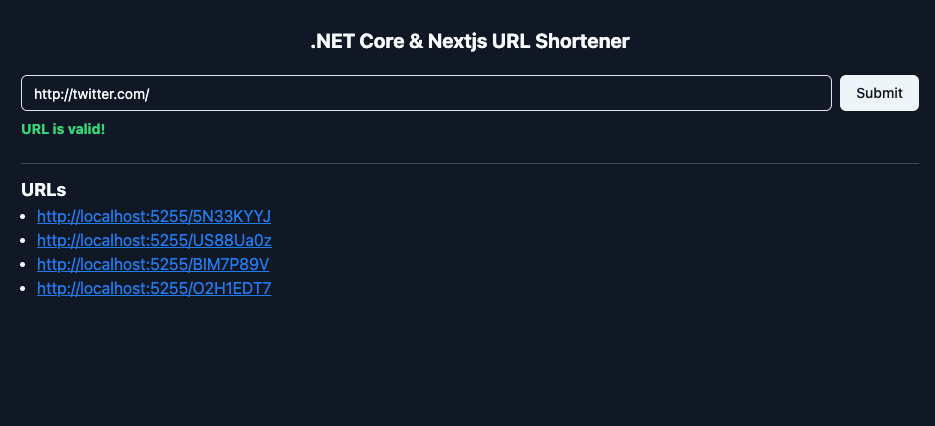

# .NET Core & Nextjs URL Shortener

This is the mini URL Shortener FullStack app with .NET Core and Nextjs.



## Tech Stacks

- .NET Core
- EF Core
- MySQL
- Nextjs
- TanStack Query
- ShadcnUI

## Scripts

### Dotnet Create Minimal Web API

```bash
dotnet new webapi -minimal -n server
```

### EF Migration

```bash
dotnet ef migrations add Init
```

```bash
dotnet ef database update
```
